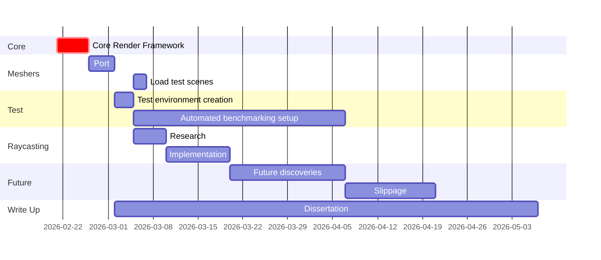

# Optimisations for a voxel engine

## Introduction

### Context

Standard rendering approaches work with pre-defined meshes, which can be statically optimised by the developers before being included in the game. These meshes only represent the surface of the object.
Voxels are a different approach that allows for depth to be expressed dynamically at runtime. With a standard rendering approach, if you cut a hole in the mesh there would be nothing behind, whereas with a voxel engine you would be able to reveal the terrain behind.

### Problem

Since GPU's are incapable of directly rendering voxels as they can with triangulated meshes, the stored voxel data needs to be transformed into a format that can be processed by the GPU.
There are two main approaches to this: meshing and raycasting. Meshing involves transforming the voxel data into a triangle mesh akin to a standard rendering approach. This approach has a simple yet inefficient starting point. Additionally the rasterisation will need to be recalculated whenever the voxel data changes.
Raycasting is a significantly more complex process that poses its own challenges, for example sending the voxel data to the GPU efficiently.

### Rationale

This project aims to show different techniques to optimise a voxel engine by comparing them to highlight where each optimisation excels and any pitfalls they present.
I will start with a basic implementation of a meshed voxel engine that draws a single cube for every voxel, then proceed to optimise it step by step.
The optimisations will be focused on voxels, or on how traditional optimisations can be adapted or improved for use with a voxel engine.
I will use OpenGL for this project as it allows for lower level control of the underlying code that would be occluded when using an engine such as Unity.

## Key Background Sources

| Resource                                                                                                           | Description                                                                                                                                                                                               | Reason                                                                                                                                                                                    |
| ------------------------------------------------------------------------------------------------------------------ | --------------------------------------------------------------------------------------------------------------------------------------------------------------------------------------------------------- | ----------------------------------------------------------------------------------------------------------------------------------------------------------------------------------------- |
| Advanced graphics programming using OpenGL [1]                                                                     | This book covers a wide variety of graphics concepts with sample implementations in OpenGL. The book is aimed at people who have a basic understanding of OpenGL and wish to expand their knowledge base. | This book primarily forms a basis for the core render pipeline. Due to the breadth of topics the book covers, it can be referenced throughout the project on anything not voxel specific. |
| Efficient sparse voxel octrees [3] and Efficient sparse voxel octrees–analysis, extensions, and implementation [4] | These papers cover an implementation of sparse voxel octrees which can be streamed to the GPU for use in a raycasting based renderer for voxels.                                                          | These two papers cover will form the basis of my own sparse voxel octree implementation, which will be implemented as an optimisation on a raycasted rendering approach.                  |
| Greedy Meshing Voxels Fast [5]                                                                                     | This talk focuses on a method of creating a mesh from voxel data through binary greedy meshing.                                                                                                           | This talk forms the basis for an implementation of the binary greedy meshing algorithm. A subset of this is used for a binary culled mesher as a standalone optimisation.                 |

## Aims and Objectives

### Aims

My project aims to start with an unoptimised voxel engine written with OpenGL in Rust. This engine will initially render each voxel individually as a cube and then I will incrementally implement optimisations step by step. Each step should explain the theory behind the implementation, how it compares to its predecessor and any detrimental effects.
The theory should not be limited to the implementation specifics as, whilst the project will use OpenGL for rendering, the optimisations this project explores should be applicable to other rendering APIs, such as Vulkan, without the need for major modifications.

### Objectives

1. Research and identify potential optimisations to implement in the project.
2. Implement a core rendering framework that can be used to implement all optimisations using Rust and OpenGL.
3. Implement a basic voxel engine that renders a single cube for each voxel as a benchmark to compare the optimisations against.
4. Create a number of test environments and scenarios that can be used to automate the benchmarking of the optimisations in the following categories: FPS with a stationary camera, FPS with a moving camera, voxel pre-processing time (for use to compare the speed of mesh regenerating when using a meshing algorithm).
5. Implement each optimisation as a standalone instance using the core render pipeline setup earlier. All optimisations should exist alongside each other and for it to be possible to select an optimisation at compile time.
6. Compare the performance of each optimisation using the scenarios and benchmarks set up in objective 4.

## Planning

I have given 5 days to implement the core render framework as this is the most important part of the implementation as everything else is based on it. I believe that 5 days is enough for this as I have already started working on it, and it is nearly at a usable state. This covers objective 2.
The meshing algorithms are already implemented but need to be ported to use the core render framework. This time is for porting over the implementations, as well as any time taken in the future required for fixes. Two days have been allocated to implement a method to load in the test scenes to be used for testing. This should not take too long as all meshers store their voxel data in a similar structure. Part of this period will cover objective 3 and the rest will contribute to objective 5.
Three days are allocated for creating test scenes. This includes smaller detailed scenes to test specifics in a contained environment as well as larger scenes that are created with basic procedural generation. Since this project does not focus on detail, these environments do not need to be overly complex.
I have a section for dedicating my time to researching raycasting techniques. This is in preparation for the implementation afterwards as I feel it best to properly understand what I am about to implement. This is tentatively allocated 5 days although I will likely start on the implementation earlier.
I intend to start writing the main dissertation after I have finished the port of the meshing algorithms. This will allow me to write each section while it is still fresh.
The time from after cone tracing is finished until a month before the due date is dedicated to any future optimisations I discover from my ongoing research.
Two weeks of slippage is included and the final two weeks are solely dedicated to finishing the dissertation. This will safeguard from tasks taking longer than expected.

### Risks
The iterative approach combined with weekly meetings with my supervisor which will help avoid feature creep and to handle unexpected complexity more efficiently.
The project uses Git for version control and is stored on the cloud using Github. This will ensure that no work is lost and any work that causes detrimental effects can be easily reverted.

## References

[1] - McReynolds, T. and Blythe, D., 2005. _Advanced graphics programming using OpenGL_. Elsevier.
[2] - Crassin, C., Neyret, F., Sainz, M., Green, S. and Eisemann, E., 2011, September. Interactive indirect illumination using voxel cone tracing. In Computer Graphics Forum (Vol. 30, No. 7, pp. 1921-1930). Oxford, UK: Blackwell Publishing Ltd.
[3] - Laine, S. and Karras, T., 2010, February. Efficient sparse voxel octrees. In _Proceedings of the 2010 ACM SIGGRAPH symposium on Interactive 3D Graphics and Games_ (pp. 55-63).
[4] - Laine, S. and Karras, T., 2010. Efficient sparse voxel octrees–analysis, extensions, and implementation. _NVIDIA Corporation_, _2_(6).
[5] - Davis Morley, 2022. _Greedy Meshing Voxels Fast_. Optimism in Design Handmade Seattle. [online] <https://www.youtube.com/watch?v=4xs66m1Of4A> (Accessed 19/02/2025).

